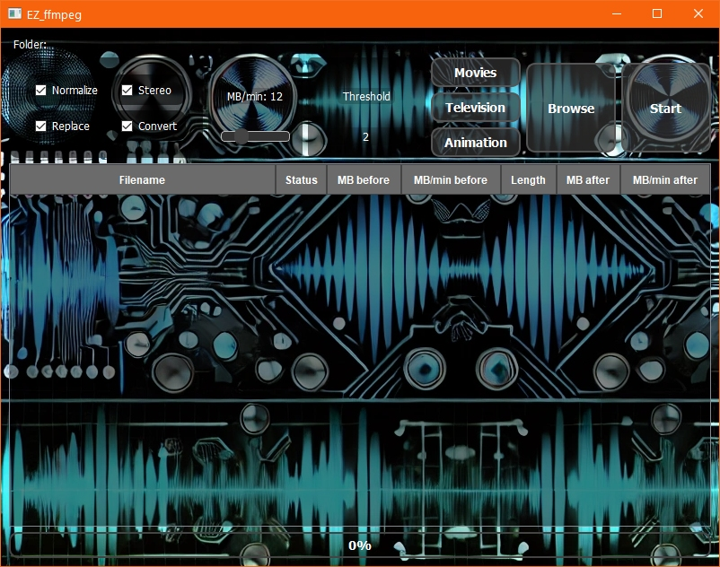

# EZ_ffmpeg

## Screenshots



EZ_ffmpeg is a simple yet powerful tool designed to shrink video files using the x265 encoding format and 192kbps MP3 audio. The application allows users to easily control the size of the output video by specifying an MB/min value, offering a straightforward way to optimize video storage and quality. Additionally, EZ_ffmpeg provides options for audio normalization and stereo flattening, ensuring that your media files maintain consistent audio quality. The application also includes presets that allow users to quickly select predefined ratios for optimal media output.

## Features

- **Video Shrinking:** Easily reduce the size of your video files using a specified MB/min value, with x265 encoding and 192kbps MP3 audio.
- **Audio Normalization:** Normalize the audio levels across your video files to ensure consistent volume.
- **Stereo Flattening:** Convert audio tracks to stereo to ensure compatibility and consistent playback quality.
- **Presets:** Quickly apply predefined settings for Movies, Television, and Animation for optimal media output.
- **Customizable Options:** Adjust MB/min value, apply normalization, stereo flattening, and decide whether to replace the original file.
- **User-Friendly Interface:** A clean and intuitive UI that allows even novice users to shrink videos with ease.

## Getting Started

### Prerequisites

- **Python 3.6+**
- **PyQt5:** Install using pip

```bash
pip install PyQt5
```

- **ffmpeg:** Ensure ffmpeg is installed and accessible in your system's PATH.

### Installation

1. Clone the repository:

```bash
git clone https://github.com/blahpunk/EZ_ffmpeg.git
cd EZ_ffmpeg
```

2. Install the required Python packages:

```bash
pip install -r requirements.txt
```

3. Run the application:

```bash
python main.py
```

## Running the Application

After launching the application, follow these steps:

1. **Browse:** Select the folder containing the video files you want to process by clicking the "Browse" button.

2. **Adjust Settings:**
    - **Convert:** Enable or disable video conversion. If unchecked, only audio normalization and stereo flattening will be applied.
    - **Normalize:** Check this box to normalize audio levels.
    - **Stereo:** Check this box to flatten the audio to stereo.
    - **Replace:** Check this box to replace the original file with the processed file.
    - **MB/min Slider:** Adjust the slider to set the target MB/min value for the output video. This directly controls the video bitrate.
    - **Threshold:** Enter a threshold value that allows some flexibility in the MB/min ratio during processing.

3. **Presets:** Quickly apply settings by selecting one of the presets:
    - **Movies:** Optimizes for standard movie output with a balanced MB/min value.
    - **Television:** Adjusts settings for television shows.
    - **Animation:** Lowers the MB/min value and threshold for animated content, which typically requires less bitrate.

4. **Start:** Once all settings are configured, click "Start" to begin processing your files.

## User Interface (UI) Elements

### Checkboxes and Sliders

- **Convert:** Toggles the conversion of video files. If unchecked, the video stream is not re-encoded, and only the audio normalization and stereo options are applied.
- **Normalize:** Applies dynamic audio normalization to the primary audio track.
- **Stereo:** Converts the primary audio track to stereo.
- **Replace:** If checked, the original file will be replaced by the processed file. If unchecked, the processed file will be saved with a different name in the same folder.
- **MB/min Slider:** Sets the target size of the output file by controlling the bitrate. A higher MB/min value results in higher video quality but larger file size.
- **Threshold:** Provides a buffer around the MB/min value, allowing for some flexibility in the file size calculation.

### Buttons

- **Browse:** Opens a file dialog to select the folder containing video files to be processed.
- **Start/Stop:** Begins the processing of files or stops the ongoing process.
- **Movies/Television/Animation:** Applies predefined settings for quick optimization based on content type.

### Table

- **Filename:** Displays the name of the video file being processed.
- **Status:** Shows the current status of the file processing (e.g., Queued, Compressing, Completed).
- **MB before:** Shows the size of the file before processing.
- **MB/min before:** Displays the MB/min value of the file before processing.
- **Length:** Shows the duration of the video.
- **MB after:** Displays the size of the file after processing.
- **MB/min after:** Shows the MB/min value of the file after processing.

## Console Output

A text area at the bottom of the UI displays the console output from ffmpeg during processing, including any errors or status updates.

## Contributing

Contributions are welcome! Please fork the repository and submit a pull request with your changes.

## License

This project is licensed under the MIT License. See the LICENSE file for more details.

## Acknowledgments

- **ffmpeg:** The powerful multimedia framework used for processing video and audio.
- **PyQt5:** The Python bindings for the Qt application framework, used to create the user interface.

### Setting Up `ffmpeg`
Ensure `ffmpeg` is installed and accessible via the command line:
- **Windows**: Add the `ffmpeg` binary to your PATH.
- **Linux**: Install `ffmpeg` via your package manager (e.g., `sudo apt-get install ffmpeg`).

## Usage

### Running the Application
1. **Start the Application**:
   ```bash
   python main.py
   ```

2. **Select a Folder**:
   - Use the "Browse" button to select the folder containing the video files you want to process.

3. **Adjust Video Settings**:
   - Utilize the user interface to adjust various video settings such as the MB/min rate and audio track conversion options.

4. **Start Processing**:
   - Click the "Start" button to begin processing. The application will display real-time progress and status updates.

## Contributing
Contributions are welcome! To contribute:
- Fork the repository.
- Create a new branch for your feature or bug fix.
- Commit your changes and push them to your branch.
- Submit a pull request.

## License
This project is licensed under the MIT License - see the [LICENSE](LICENSE) file for details.

## Acknowledgements
Special thanks to the `ffmpeg` community for their powerful media processing tools.
