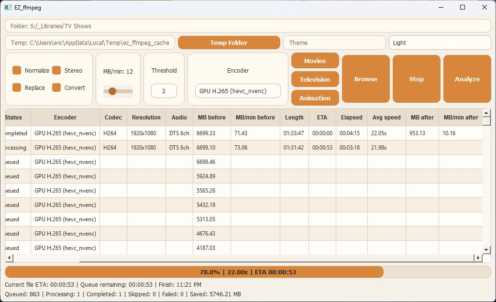

# EZ_ffmpeg

Batch video recompression with a desktop UI for FFmpeg.

EZ_ffmpeg scans a folder recursively, builds a queue of video files, analyzes them, and processes them one at a time using bitrate targets based on MB/min. The app now supports CPU and NVIDIA GPU encoder selection, queue analysis, live ETA reporting, temp-folder selection, replace-or-save output handling, and built-in light/dark themes.

## Screenshot



## What It Does

- Recursively scans a folder for video files and queues them by size.
- Sorts the queue largest-first after loading.
- Analyzes source duration, codec, resolution, audio info, and MB/min before processing.
- Supports encoder selection:
  - `CPU H.265 (libx265)`
  - `GPU H.264 (h264_nvenc)`
  - `GPU H.265 (hevc_nvenc)`
  - `GPU AV1 (av1_nvenc)` when available
  - `Auto`
- Shows live per-file progress, speed, elapsed time, and ETA.
- Shows queue-level ETA, finish time, completion counts, and total space saved.
- Uses a temp/cache folder for work files and lets you choose where that cache lives.
- Replaces the original after validation when `Replace` is enabled.
- Saves a uniquely named `_processed` file beside the source when `Replace` is disabled.
- Includes a default light theme and an alternate dark theme.

## Requirements

- Python 3
- `ffmpeg` and `ffprobe` available in `PATH`
- PyQt5

Install Python dependencies with:

```bash
pip install -r requirements.txt
```

## Installation

```bash
git clone https://github.com/blahpunk/EZ_ffmpeg.git
cd EZ_ffmpeg
pip install -r requirements.txt
python main.py
```

## Workflow

1. Click `Browse` and choose the root folder you want to scan.
2. Wait for the queue to finish loading and sort largest-first.
3. Set your processing options:
   - `Normalize`
   - `Stereo`
   - `Replace`
   - `Convert`
   - `MB/min`
   - `Threshold`
   - `Encoder`
   - `Theme`
   - `Temp Folder`
4. Optionally click `Analyze` to populate queue metadata and estimated runtimes before processing.
5. Click `Start` to begin conversion.
6. If you press `Stop`, choose whether to:
   - finish the current file and stop the queue after it completes
   - abort immediately
   - cancel the stop request

## Main Controls

### Folder And Temp Paths

- `Folder`: Shows the source folder currently loaded into the queue.
- `Temp Folder`: Chooses the parent location for the app cache. EZ_ffmpeg uses a dedicated `ez_ffmpeg_cache` subfolder inside the selected location.

### Processing Options

- `Normalize`: Re-encodes audio with `dynaudnorm`.
- `Stereo`: Downmixes audio to 2 channels.
- `Replace`: Replaces the original file after output validation succeeds.
- `Convert`: Forces audio re-encoding to AAC. If disabled and no audio processing is required, audio can be copied.
- `MB/min`: Sets the approximate target size budget per minute.
- `Threshold`: Skips files that are already below the target plus threshold.
- `Encoder`: Selects the active video encoder mode.

### Presets

- `Movies`
- `Television`
- `Animation`

These presets adjust the `MB/min` slider and threshold for quicker setup.

### Queue Actions

- `Analyze`: Runs a metadata and estimate pass without encoding.
- `Start`: Starts processing from the top of the queue.
- `Stop`: Opens a stop dialog while processing.

## Queue Columns

- `Filename`
- `Status`
- `Encoder`
- `Codec`
- `Resolution`
- `Audio`
- `MB before`
- `MB/min before`
- `Length`
- `ETA`
- `Elapsed`
- `Avg speed`
- `MB after`
- `MB/min after`

## Processing Statuses

During processing you may see statuses such as:

- `Probing`
- `Checking thresholds`
- `Copying to cache`
- `Launching encoder`
- `Processing`
- `Finalizing`
- `Replacing`
- `Moving output`
- `Completed`
- `Skipped`

## Output Rules

### When `Replace` Is Enabled

- The file is encoded into the temp/cache folder first.
- The result is validated:
  - output must be smaller than the source
  - output duration must be close to the source duration
- If validation passes, the original is replaced.

### When `Replace` Is Disabled

- The file is encoded into the temp/cache folder first.
- After validation, the processed file is moved into the source directory.
- The filename uses `_processed`.
- If that name already exists, the app creates `_processed_1`, `_processed_2`, and so on instead of overwriting.

## Temp Files And Cleanup

- EZ_ffmpeg uses a dedicated cache folder for copied inputs and temporary outputs.
- Stale cache files are cleaned on startup.
- If the app is closed while work is in progress, it attempts to abort active work and clean up partial temp artifacts.
- Encode history is preserved separately so runtime estimates can improve over time.

## Themes

- `Light` is the default theme.
- `Dark` is the alternate theme.
- The selected theme is saved in `settings.ini` and restored at launch.

## Settings Persistence

The app remembers:

- normalize / stereo / replace / convert
- selected encoder
- selected theme
- selected temp folder
- last browsed source folder

## Notes

- Queue estimates are best after running `Analyze` or after the app has built some encode-history data.
- Encoder availability depends on the FFmpeg build installed on your system.
- On Windows, cross-drive replacement is handled during finalization so cache folders and source libraries can live on different drives.

## Troubleshooting

### FFmpeg Not Found

Make sure both `ffmpeg` and `ffprobe` are installed and available in `PATH`.

### NVIDIA Encoders Not Showing Up

Your FFmpeg build, driver, or GPU may not expose NVENC/AV1 support. The app only shows encoder modes that FFmpeg reports as available.

### Processed File Was Skipped

If a file is already below the target `MB/min + Threshold`, the app skips it instead of making it larger or wasting time re-encoding.

### Replace Failed

Replacement only happens after validation. If replacement fails, the status column will show the error and the original file is left in place.

## License

This project is licensed under the MIT License. See [LICENSE](LICENSE).
